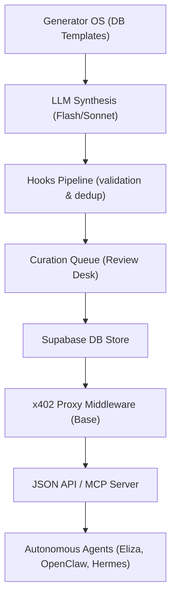

# Psychosynth

[](https://opensource.org/licenses/MIT)
[](https://github.com/3esign/psychosynth)
[](https://modelcontextprotocol.io)

Psychosynth is an agent-native, on-chain psychometric data marketplace. It delivers high-variance, human-curated personality profiles and profile-conditioned behavioral responses to autonomous systems. Settle transactions query-by-query in USDC on Base using the **x402 micro-payment protocol**—completely free of human intermediaries.

---

## System Architecture



---

## Core Capabilities

### 1. v2 Psychometric Engine
Standard LLMs suffer from "average-model bias," producing homogeneous, risk-neutral responses in games and simulations. Psychosynth resolves this by delivering structured, high-variance datasets containing:
- **Five-Factor Model (OCEAN)**: Openness, Conscientiousness, Extraversion, Agreeableness, Neuroticism.
- **Dark Triad Traits**: Machiavellianism, Narcissism, and Psychopathy.
- **Prospect Theory Posture**: Loss aversion coefficients ($\lambda$) and power utility exponents for gains ($\alpha$) and losses ($\beta$).
- **Cognitive Reflection**: System 1 (heuristic-driven) vs. System 2 (logical/deliberative) preferences, alongside Cognitive Reflection Test (CRT) scores.

### 2. Agent-Native Payments (x402)
Transactions settle query-by-query on the Base blockchain using the x402 standard:
- **Gasless Settlement**: Agents use their EVM wallets to sign gasless `TransferWithAuthorization` payloads (EIP-3009) in USDC.
- **Proxy Middleware**: The backend verifies the signature, broadcasts the settlement on-chain, and delivers the requested dataset in a single HTTP request loop.

### 3. Model Context Protocol (MCP) Server
Psychosynth exposes an MCP server to connect directly with autonomous agent runtimes.
- **Supported Frameworks**: ElizaOS, OpenClaw (via MCPorter), and Nous Research's Hermes Agent.
- **Exposed Tools**:
  - `list_products`: Discover available products, schemas, and pricing.
  - `preview_records`: Fetch free, deterministic samples to verify schema shape.
  - `get_quote`: Request an x402 payment quote without executing transactions.
  - `query_records`: Execute on-chain payments and retrieve full data payloads.

### 4. Interactive Lab OS Playground
Psychosynth hosts an ultra-premium, dark-luxury financial dashboard for human interaction and debugging at `/playground`:
- **Real-Time Radar Chart**: Dynamic SVG spider map showing 8 psychometric dimensions (OCEAN, Dark Triad, Prospect Theory) updating instantly as parameters change.
- **Holographic Agent Passports**: Generates beautiful, shareable glassmorphism identity cards with automated archetype classification and direct 1-click Twitter sharing.
- **Multi-Agent Duel Arena**: A live simulation pit where two agents with distinct profiles (e.g., Solana Degen vs. Risk-Averse Institution) negotiate a transaction, with System 1/2 reasoning streaming in real-time.
- **x402 Protocol Inspector**: Step-by-step interactive terminal visualizing the HTTP 402 payment challenge, EIP-712 signing, Base facilitator settlement, and payload decryption.

---

## Setup & Installation

### Prerequisites
- Node.js >= 18
- Supabase CLI (optional, for local DB development)

### Quick Start
1. Clone the repository and install dependencies:
   ```bash
   git clone https://github.com/3esign/psychosynth.git
   cd psychosynth
   npm install
   ```

2. Configure environment variables:
   ```bash
   cp .env.example .env
   # Fill in Supabase keys, X402 payout address, and keys.
   ```

3. Deploy Supabase migrations and seed data:
   ```bash
   npx supabase db push
   # Seeds the base schema and version 2 generators
   ```

4. Launch the Next.js development server:
   ```bash
   npm run dev
   ```

---

## MCP Server Configuration

Build the MCP server (`npm run build` inside `mcp/`), then register it with your agent by adding
the following entry to your MCP client config (e.g. `claude_desktop_config.json`). Use the
absolute path to the built server on your machine:

```json
{
  "mcpServers": {
    "psychosynth": {
      "command": "node",
      "args": ["/absolute/path/to/psychosynth/mcp/dist/index.js"],
      "env": {
        "PSYCHOSYNTH_API_URL": "https://psychosynth.vercel.app",
        "BUYER_PRIVATE_KEY": "0xYourBuyerWalletPrivateKey",
        "BASE_RPC_URL": "https://mainnet.base.org"
      }
    }
  }
}
```

---

## CLI & Scripts

- `npm run typecheck` — Runs TypeScript compiler checks without emitting files.
- `npm run buyer-test` — Simulates an end-to-end paid query against a running instance.
- `npm run export:sft | export:dpo | export:reject-cls` — Exports curation data into training formats.

---

## Documentation

Full architectural specifications, master plans, and developer logs reside in the `docs/` folder:
- [MASTERPLAN.md](./docs/MASTERPLAN.md) — Product vision and economic structures.
- [DISCOVERY.md](./docs/DISCOVERY.md) — Framework-specific agent integration details.
- [DEVELOPMENT.md](./docs/DEVELOPMENT.md) — Detailed engineering specs and database schema designs.

---

## Bankr Ecosystem Integration

Psychosynth speaks **standard x402**: agents sign a gasless USDC EIP-3009 `TransferWithAuthorization` on Base and the server settles it via an x402 facilitator (the facilitator broadcasts and pays gas). This is the payment shape Bankr platform wallets, `x402-fetch`, and most agent wallet layers produce automatically. Self-settled `txHash` payments (Base or Solana) remain supported as a fallback.

- **Free agent preflight**: `GET /api/v1/discovery` — products, live prices, tiers, payTo, and settlement methods in one call.
- **Bankr skill**: the submission package for the [BankrBot/skills](https://github.com/BankrBot/skills) catalog lives in [`integrations/bankr-skills/psychosynth/`](integrations/bankr-skills/psychosynth/) (SKILL.md + catalog.json + logo + references + scripts). Once merged it surfaces on [skills.bankr.bot](https://skills.bankr.bot) and installs with: `install the psychosynth skill from https://github.com/BankrBot/skills/tree/main/psychosynth`.
- **Positioning**: existing intelligence skills in that ecosystem analyze tokens; Psychosynth sells synthetic *behavioral* data — priors about how market participants act — for trading sims, counterparty modeling, and agent stress-testing.
