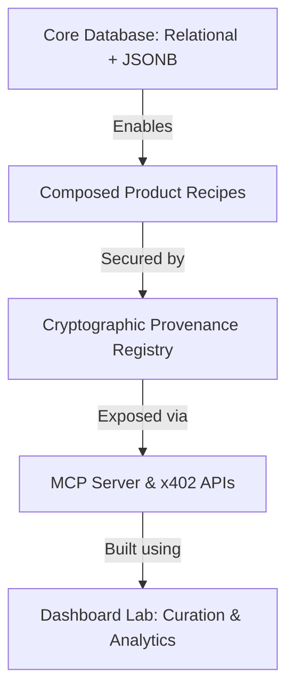

# PSYCHOSYNTH (FACES) — Comparative Analysis of Architecture Ideas

This document aligns all five generated design ideas into a single, standardized framework. By placing them side-by-side, it removes duplicates, highlights key architectural tradeoffs, and allows us to pick, mix, and design the final specification.

---

# 1. High-Level Comparison Matrix

| Dimension | Idea 1: FACES MVP | Idea 2: Pragmatic Marketplace | Idea 3: Commercial GTM | Idea 4: Intelligence OS | Idea 5: Verified Infrastructure |
| :--- | :--- | :--- | :--- | :--- | :--- |
| **Core Concept** | Standard synthetic psychology data vendor. | Simple, no-nonsense developer API marketplace. | Full-scale commercial launchpad & agent economy. | Psychological Intelligence OS & Knowledge Graph. | Verified behavioral infrastructure (Trust registry). |
| **Primary Moat** | Speed to draft. | Low initial overhead & execution speed. | Distribution channels & ecosystem integrations. | Combinatorial graph relationships. | Cryptographic provenance & academic validation. |
| **Database Model** | Standard relational. | Relational with JSONB payloads. | Complex relational with curation queues. | 5-Layer Knowledge Graph. | Relational + Provenance registry table. |
| **Default Chain** | Solana (SOL/USDC). | Base (EVM USDC). | Solana (USDC) + Base. | Chain-agnostic API. | Solana (provenance) + Base/EVM (payments). |
| **Commerce Layer** | x402 per query. | x402 per query + offline packs. | Dynamic pricing, JWT tokens, & ACP. | Simple API first, x402 later. | x402 + On-chain signatures & Escrows. |
| **Discovery Channel**| UI Dashboard. | Developer docs. | Solana Agent Kit, Eliza OS plugins. | Automated Agent Crawlers. | MCP Server, Solana Agent Kit, ACP registries. |
| **Academic Angle** | None. | None. | Mild. | General research references. | High (Union Nikola Tesla, arXiv preprint). |

---

# 2. Standardized Concept Profiles

---

## Concept 1: FACES MVP (Idea 1)
*The baseline relational data vendor.*

*   **Core Thesis**: AI agents need psychological diversity to simulate human scenarios. We build a simple relational database of personality profiles and scenarios, selling access to structured JSON data.
*   **Key Design Choices**:
    *   *Traits*: Combines Big Five (OCEAN) and MBTI.
    *   *Chain/Payment*: Solana-first USDC micropayments via x402.
    *   *Tooling*: Internal Dashboard Lab built early in Phase 1 to manage generation.
*   **Data Model Structure**:
    *   Relational tables: `profiles`, `scenarios`, `biases`, `profile_bias_links`, `profile_scenario_responses`, `products`, `x402_payments`.
*   **7-Phase Summary**:
    1.  Core DB Schema & Local LLM Generators.
    2.  Product Orchestration API Layer.
    3.  Solana x402 Middleware.
    4.  Agent Playground & SDK.
    5.  Curation Engine.
    6.  Base Chain & Virtuals ACP Integration.
    7.  Production Scale & Launch.
*   **Pros**: Simple to understand; covers standard database relationships.
*   **Cons**: No unique defensible moat; MBTI inclusion reduces academic credibility; building a dashboard in Phase 1 slows down time-to-first-payment.

---

## Concept 2: Pragmatic Marketplace (Idea 2)
*The lean developer-first launch.*

*   **Core Thesis**: Prove value before building overhead. Cut out Robinhood, defer Virtuals ACP, deprecate MBTI entirely in favor of Big Five, and focus on delivering three core queryable products.
*   **Key Design Choices**:
    *   *Traits*: Big Five (OCEAN) exclusively for psychological validity.
    *   *Chain/Payment*: Base-first x402 (Coinbase's free payment facilitation tier). Offer offline "packs" alongside single-query APIs.
    *   *Tooling*: Defer the Dashboard Lab. Use Supabase Studio for curation; build the lab in Phase 4 once revenue is proven.
*   **Data Model Structure**:
    *   Relational: `profiles`, `scenarios`, `biases`, `emotional_patterns`, `decision_styles`, `profile_bias_links`, `profile_scenario_responses`, `scenario_bias_applications`, `products`, `curation_queue`.
*   **7-Phase Summary**:
    1.  MVP Spine (Base tables + x402 Base).
    2.  Relational Layer (Scenario conditioning).
    3.  Recipe Engine (Composing products via JSON config).
    4.  Dashboard Lab (Internal tools).
    5.  Commerce Hardening (Pre-authorization, refunds).
    6.  Catalog Expansion (Secondary sales, MCP wrappers).
    7.  Scale & Quality (Outreach, rate limiting).
*   **Pros**: Exceptionally fast time-to-market; extremely low upfront costs; clean separation of data generation from product recipes.
*   **Cons**: Lacks automated trust verification on-chain; marketing relies purely on traditional developer outreach.

---

## Concept 3: Commercial GTM (Idea 3)
*The full-scale agentic web3 launch (PSYCHOSYNTH).*

*   **Core Thesis**: Build a self-reinforcing tokenized agent economy. Position Psychosynth as the "Bloomberg of Agent Psychology" by integrating deeply into web3 agent toolkits.
*   **Key Design Choices**:
    *   *Traits*: Big Five + cosmetic MBTI support.
    *   *Chain/Payment*: Solana (USDC/SOL) with dynamic pricing (demand-based surges) and tokenized discount tokens ($PSYCH).
    *   *Tooling*: Internal Dashboard Lab with email auth and automatic AI generation forms.
*   **Data Model Structure**:
    *   Relational + Orchestration: Adds `versions_changelogs` and component config column maps.
*   **7-Phase Summary**:
    1.  MVP Core (Schema, simple x402 middleware on Solana).
    2.  Product Expansion Engine (Product Builder UI).
    3.  Agent-Native Commerce (Solana Agent Kit & Eliza plugin registry).
    4.  Niche Intelligence Suites (Premium pricing tiers, custom request invoicing).
    5.  Benchmark & Trust Layer (On-chain method hashing + community rating feedback loop).
    6.  Ecosystem Tokenization (Virtuals Base compatibility, $PSYCH launch, Base Bridge).
    7.  Scale & Network Effects (A2A marketplace, Series A positioning).
*   **Pros**: Strong web3-native marketing plan; clear GTM channels (Solana Agent Kit, Eliza plugin); detailed commercial milestones.
*   **Cons**: Heavily reliant on token economics and multi-chain bridge complexity in later phases; complex early infrastructure.

---

## Concept 4: Intelligence OS (Idea 4)
*The unified psychological knowledge graph.*

*   **Core Thesis**: Stop thinking about datasets as isolated files. Build a 5-layer psychological knowledge graph where profiles, scenarios, reasoning paths, and simulations are interconnected nodes. Products are simply visual or API "views" filtered over this graph.
*   **Key Design Choices**:
    *   *Traits*: Broad trait primitives ( OCEAN, motivations, values, learning styles).
    *   *Chain/Payment*: API-first; payment rails (Stripe/x402) are secondary implementation details.
    *   *Tooling*: The Graph Explorer (internal visual editor) is the core product factory.
*   **Data Model Structure**:
    *   5-Layer Conceptual Model:
        *   *Layer 1 (Primitives)*: Profiles, traits, emotions, biases, values.
        *   *Layer 2 (Behavior)*: Scenarios, conflicts, purchasing decisions.
        *   *Layer 3 (Reasoning)*: Inner monologue, thought chains, uncertainty.
        *   *Layer 4 (Simulation)*: Complete virtual markets, communities, and DAOs.
        *   *Layer 5 (Products)*: Configuration rules referencing Layers 1–4.
*   **7-Phase Summary**:
    1.  MVP Graph (Five entities, Next.js dashboard).
    2.  Knowledge Graph (Connecting traits, biases, decisions, and responses).
    3.  Intelligence Lab (Faceted explorers, knowledge diffs, method editors).
    4.  Product Factory (Dynamic recipe generation).
    5.  Agent Platform (Pay-per-call simulation APIs).
    6.  Agent Marketplace (Autonomous discovery).
    7.  Psychological OS (Licensing to game studios, trading firms, enterprise).
*   **Pros**: Most defensible long-term product vision; represents a true technological moat; easily adaptable to non-crypto markets (gaming, enterprise, academia).
*   **Cons**: High initial implementation complexity; graph querying is harder to write and scale than simple relational tables.

---

## Concept 5: Verified Infrastructure (Idea 5)
*The cryptographic provenance registry.*

*   **Core Thesis**: Generating synthetic data is cheap; verifying its quality and authenticity is hard. Build a trust stack based on cryptographic provenance, deterministic reproducibility, and query-time composition.
*   **Key Design Choices**:
    *   *Traits*: Academic psychological instruments (IPIP-NEO, Kahneman/Tversky sources).
    *   *Chain/Payment*: Solana for provenance registry (SHA-256 hashes of methodology), Base/Solana for x402 payments.
    *   *Tooling*: Internal lab is public-facing from Day 1 to build academic credibility and act as a lead-generation funnel.
*   **Data Model Structure**:
    *   Relational + Provenance: `profiles`, `scenarios`, `biases`, `profile_bias_links`, `profile_scenario_responses`, `provenance` (SHA-256 hash, prompts, seeds, signatures, attestations), `recipes`, `products`, `versions_changelog`.
*   **7-Phase Summary**:
    1.  MVP Foundation & Revenue Loop (Solana x402 API, simple provenance schema).
    2.  Product Suite via Recipes (Products, recipes, changelog, 5% free previews).
    3.  Curation Dashboard Lab (Methodology tracker, statistical population validation).
    4.  Agent-Native Discovery (MCP Server, Solana Agent Kit, Virtuals ACP, OpenAPI).
    5.  Trust & Provenance (Registry program, signed reviews, academic validations).
    6.  Composition Engine (Query-time dynamic joining and seed-based reproducibility).
    7.  Ecosystem & Scale (Open public dashboard, arXiv preprint, multi-chain).
*   **Pros**: Highest credibility design; makes synthetic data defensible; deterministic seeding is highly attractive for agent developers running evaluations; arXiv publication acts as permanent organic acquisition.
*   **Cons**: Setup of cryptographic signatures in Phase 1 requires careful keys management; requires external validation coordination in Phase 5.

---

# 3. Key Architectural Decision Points

To synthesize the final spec, we need to choose our path on these four pivot points:

### Pivot A: Trait Model
*   **Option 1 (Big Five / OCEAN)**: Focus entirely on academic models. Best for credibility, benchmark suites, and publication.
*   **Option 2 (Big Five + cosmetic MBTI)**: Use Big Five under the hood, but display MBTI in the UI/payloads. Good for developers who search for "INTJ agent."
*   **Option 3 (Holistic Graph Primitives)**: Expand traits to values, motivations, and decision-making styles (Idea 4).

### Pivot B: Database Design
*   **Option 1 (Relational with JSONB)**: Simple, fast, easy to write query optimizations (Idea 1/2/3).
*   **Option 2 (Relational + Component Recipe Engine)**: Keep tables relational, but compile products dynamically based on JSON recipe configuration (Idea 2/5).
*   **Option 3 (True Knowledge Graph)**: Transition database to a graph model to link traits, behaviors, and internal monologues (Idea 4).

### Pivot C: Trust Layer (The Moat)
*   **Option 1 (No trust layer)**: Standard API with credentials. Low overhead, but low defense against copycats.
*   **Option 2 (Internal Quality Scoring)**: Local LLM evaluation scripts (Idea 3).
*   **Option 3 (Cryptographic Provenance)**: Dataset SHA-256 hashes, deterministic seeds, signing keys, and on-chain registries (Idea 5).

### Pivot D: Go-To-Market / Payment Chain
*   **Option 1 (Base/EVM x402)**: Simplest integration path, leverages high current x402 EVM transaction volume.
*   **Option 2 (Solana x402 + Registry)**: Low transaction fees, native access to Solana's booming agent community.
*   **Option 3 (Multi-chain + MCP Server + ACP)**: Maximize reach by building wrappers (MCP, Solana Agent Kit, Eliza plugins) simultaneously.

---

# 4. Blueprint for the Synthesized Final Spec
*(A suggested hybrid design that captures maximum value with realistic execution milestones)*

### Proposed Synthesis: "PSYCHOSYNTH: Verified Behavioral Substrate"
1.  **Phase 1 Foundation**: Build the **Idea 5** schema (relational with a built-in `provenance` metadata table). This ensures we have cryptographic signatures, prompt hashes, and deterministic seeds from day one, without needing to rewrite schemas later.
2.  **Phase 2 Products**: Implement **Idea 2's** Product Recipe engine. Create the Personality Profile Library and Behavioral Scenario Library by writing config templates, proving the modular design immediately.
3.  **Phase 3 Curation & Credibility**: Launch the **Idea 3/5** internal Dashboard Lab. Add population distribution checks and prepare an arXiv methodology preprint leveraging academic credentials.
4.  **Phase 4 Discovery**: Package the engine as an **MCP Server** and a **Solana Agent Kit Plugin** to hit all major developer communities at once.
5.  **Phase 5-7 Scaling**: Roll out the on-chain registries, seed-based custom composition engine, and open the public-facing dashboard.
