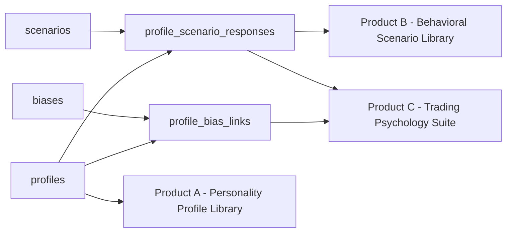

# Psych-Data Agent Marketplace — Architecture & Build Plan

Synthetic psychological/behavioral data, sold to AI agents as an agent-native product, paid for over HTTP rather than a subscription. This document picks up from the earlier brainstorm, cuts what isn't needed yet, and turns the rest into something buildable: three MVP products mapped to exact database queries, and a seven-phase plan where phase 1 is real and shippable, not aspirational.

## What's different from the original brainstorm

A few calls made while cleaning this up, and why:

- **Cutting Robinhood entirely, for now.** Robinhood's Trading and Banking MCP servers are real and launched in late May 2026, but they're the wrong layer here — they let *a user's own agent* trade or spend on that user's behalf. They don't help other agents discover and pay for your data. Worth revisiting only if you later build a trading-execution companion product on top of the psychology data itself.
- **Cutting Virtuals' tokenization/ACP from phases 1–3.** Real, well-built infrastructure, but it adds negotiation, escrow, and evaluation overhead your catalog products don't need yet. Parked for Phase 6, where it's actually the right tool.
- **Demoting MBTI.** Keep it as an optional cosmetic label if agents want something recognizable, but the trait model actually backing every profile should be Big Five/OCEAN — it's what serious synthetic-persona research and psychometrics actually use. MBTI has well-documented reliability problems, and you don't want your credibility resting on it once anyone technical looks under the hood.
- **Demoting the Dashboard Lab.** Genuinely useful, just not first. A polished curation UI before a single agent has paid for a single profile is solving a problem you don't have yet.
- **One naming trap to flag permanently:** there are two unrelated protocols both called "ACP" in this space — Virtuals Protocol's Agent Commerce Protocol (on-chain job/escrow coordination between agents, lives on Base) and Stripe/OpenAI's separate Agentic Commerce Protocol (live inside ChatGPT's checkout, built for humans shopping through an agent). They come up interchangeably in search results. They are not the same thing — more below.

## The three MVP products

Picked to force the database architecture to prove itself in order, not because they're the easiest to write marketing copy for. Each exercises a different level of the system:

| Product | Proves | Tables touched |
|---|---|---|
| **A — Personality Profile Library** | The atomic layer works | `profiles` only |
| **B — Behavioral Scenario Library** | Relations compound existing data | `profiles`, `scenarios`, `profile_scenario_responses` |
| **C — Trading Psychology Suite** | Recipes compose products without new code | `profiles`, `biases`, `scenarios`, both junctions |

Ship them in that order. By the time Product C exists, adding a fourth product is a config change, not a new backend.

## Data model

Starter schema — Postgres/Supabase, JSONB for flexible trait data. Treat this as a first draft to refine once you're actually writing generation prompts against it, not a final spec.

```sql
-- CORE ENTITIES

CREATE TABLE profiles (
  id                      UUID PRIMARY KEY DEFAULT gen_random_uuid(),
  version                 INT NOT NULL DEFAULT 1,
  big_five                JSONB NOT NULL,   -- {openness, conscientiousness, extraversion, agreeableness, neuroticism}, 0-100 each
  mbti_label              TEXT,             -- cosmetic only, never the source of truth
  decision_style_id       UUID REFERENCES decision_styles(id),
  tags                    TEXT[] NOT NULL DEFAULT '{}',
  generation_prompt_hash  TEXT,
  quality_score           NUMERIC,
  status                  TEXT NOT NULL DEFAULT 'pending',  -- pending | approved | rejected
  created_at              TIMESTAMPTZ NOT NULL DEFAULT now()
);

CREATE TABLE scenarios (
  id           UUID PRIMARY KEY DEFAULT gen_random_uuid(),
  version      INT NOT NULL DEFAULT 1,
  title        TEXT NOT NULL,
  description  TEXT,
  category     TEXT NOT NULL,   -- trading | negotiation | social | workplace | crisis ...
  tags         TEXT[] NOT NULL DEFAULT '{}',
  status       TEXT NOT NULL DEFAULT 'pending',
  created_at   TIMESTAMPTZ NOT NULL DEFAULT now()
);

CREATE TABLE biases (
  id                     UUID PRIMARY KEY DEFAULT gen_random_uuid(),
  name                   TEXT NOT NULL,   -- 'Loss Aversion', 'FOMO', 'Herd Behavior', 'Disposition Effect' ...
  description            TEXT,
  examples               JSONB,
  mitigation_strategies  JSONB
);

CREATE TABLE emotional_patterns (
  id                 UUID PRIMARY KEY DEFAULT gen_random_uuid(),
  trigger            TEXT NOT NULL,
  response_patterns  JSONB,
  intensity_levels   JSONB
);

CREATE TABLE decision_styles (
  id           UUID PRIMARY KEY DEFAULT gen_random_uuid(),
  name         TEXT NOT NULL,
  description  TEXT
);

-- JUNCTIONS

CREATE TABLE profile_bias_links (
  profile_id  UUID REFERENCES profiles(id),
  bias_id     UUID REFERENCES biases(id),
  strength    NUMERIC,  -- 0..1
  PRIMARY KEY (profile_id, bias_id)
);

CREATE TABLE profile_scenario_responses (
  id           UUID PRIMARY KEY DEFAULT gen_random_uuid(),
  profile_id   UUID REFERENCES profiles(id),
  scenario_id  UUID REFERENCES scenarios(id),
  response     TEXT NOT NULL,
  reasoning    TEXT,
  created_at   TIMESTAMPTZ NOT NULL DEFAULT now()
);

CREATE TABLE scenario_bias_applications (
  scenario_id  UUID REFERENCES scenarios(id),
  bias_id      UUID REFERENCES biases(id),
  relevance    NUMERIC,
  PRIMARY KEY (scenario_id, bias_id)
);

-- ORCHESTRATION

CREATE TABLE products (
  id           UUID PRIMARY KEY DEFAULT gen_random_uuid(),
  slug         TEXT UNIQUE NOT NULL,   -- 'personality-profile-library'
  name         TEXT NOT NULL,
  version      INT NOT NULL DEFAULT 1,
  recipe       JSONB NOT NULL,         -- filter/join rules, see below
  price_model  JSONB NOT NULL,         -- {"type":"per_query","usdc":0.02}
  status       TEXT NOT NULL DEFAULT 'draft'
);

CREATE TABLE curation_queue (
  id             UUID PRIMARY KEY DEFAULT gen_random_uuid(),
  entity_type    TEXT NOT NULL,  -- 'profile' | 'scenario' | 'bias' ...
  entity_id      UUID NOT NULL,
  reviewer_note  TEXT,
  created_at     TIMESTAMPTZ NOT NULL DEFAULT now()
);
```

How the pieces connect:



## Exactly how each product pulls from the DB

### Product A — Personality Profile Library

Single table, filtered. This is why it ships first — zero dependencies on anything else.

```sql
SELECT id, big_five, mbti_label, decision_style_id, tags
FROM profiles
WHERE status = 'approved'
  AND tags && :requested_tags              -- array overlap
  AND (big_five->>'neuroticism')::numeric >= :min_neuroticism
ORDER BY random()
LIMIT :n;
```

`GET /v1/products/personality-profile-library?tags=risk_averse,analytical&limit=25`

### Product B — Behavioral Scenario Library

Two joins deep: scenario → the response it produced → the profile that produced it.

```sql
SELECT s.title, s.category, psr.response, psr.reasoning,
       p.big_five, p.tags AS profile_tags
FROM scenarios s
JOIN profile_scenario_responses psr ON psr.scenario_id = s.id
JOIN profiles p ON p.id = psr.profile_id
WHERE s.status = 'approved'
  AND s.category = :category
LIMIT :n;
```

`GET /v1/products/behavioral-scenario-library?category=negotiation&limit=10`

This is the first real compounding win — every profile from Product A gets reused here at zero additional generation cost. You're conditioning existing personalities on new situations, not inventing new ones.

### Product C — Trading Psychology Suite

Not a new table — a `products.recipe` config that joins across everything Products A and B already built:

```json
{
  "base_entity": "profiles",
  "filters": { "tags_any": ["trading", "crypto", "risk"] },
  "joins": [
    { "table": "profile_bias_links", "via": "profile_id",
      "filter": { "bias.name_in": ["Loss Aversion", "FOMO", "Herd Behavior", "Disposition Effect"] } },
    { "table": "profile_scenario_responses", "via": "profile_id",
      "filter": { "scenario.category": "trading" } }
  ]
}
```

Resolved by the service layer into something like:

```sql
SELECT p.id, p.big_five, p.tags,
       array_agg(DISTINCT b.name) AS active_biases,
       jsonb_agg(DISTINCT jsonb_build_object('scenario', sc.title, 'response', psr.response)) AS scenario_responses
FROM profiles p
JOIN profile_bias_links pbl ON pbl.profile_id = p.id
JOIN biases b ON b.id = pbl.bias_id AND b.name = ANY(:trading_biases)
JOIN profile_scenario_responses psr ON psr.profile_id = p.id
JOIN scenarios sc ON sc.id = psr.scenario_id AND sc.category = 'trading'
WHERE p.status = 'approved'
GROUP BY p.id;
```

`GET /v1/products/trading-psychology-suite?sample_size=50`

Highest-value product in the initial three — it saves the buyer three separate calls and their own join logic. Given you're already inside the Solana meme-coin/trading-agent world through Pumpolis, this is the product with the shortest path to a first real customer.

## Payment & discovery layer

**Use x402 for phase 1.** It's a single middleware line, chain-agnostic, settles in USDC, and Coinbase's hosted facilitator is free for the first 1,000 transactions a month. Start on Base — it currently carries the large majority of real x402 transaction volume — and mirror the same endpoints on Solana once traffic justifies it; Solana's share of weekly x402 volume has been closing the gap with Base.

One pricing note worth testing rather than assuming: real x402 volume has skewed toward fewer, larger payments rather than pure $0.01 micropayments. Don't lock in ultra-granular per-item pricing as the only option — offer packs (e.g. 50 profiles per purchase) alongside single-query pricing and see which one agents actually reach for.

**Don't reach for Virtuals' ACP or Google's AP2 in phase 1.** Both solve real problems — ACP adds escrow, negotiation, and an evaluation step for bespoke higher-value engagements; AP2 adds a cryptographic "a human actually authorized this agent's purchase" audit trail for compliance-sensitive buyers — but neither is needed to sell a two-cent profile over an API, and both add real integration weight. ACP earns its place in Phase 6 for the custom-bundle-on-request product. AP2 is worth revisiting in Phase 7 only if an enterprise or institutional buyer needs that audit trail — it's still a young spec, so there's no rush.

Reminder since it's an easy mix-up: Virtuals' Agent Commerce Protocol and Stripe/OpenAI's Agentic Commerce Protocol are unrelated systems that happen to share an acronym. The Stripe/OpenAI one lives inside ChatGPT's checkout for human shopping; it isn't relevant to this build at all.

## The seven-phase build plan

| Phase | Focus | Ships | Core additions |
|---|---|---|---|
| 1 | MVP spine | Personality Profile Library | `profiles`, `products`, `curation_queue`; bare x402 gate on Base |
| 2 | Relational layer | Behavioral Scenario Library | `scenarios`, `profile_scenario_responses` |
| 3 | Recipe engine | Trading Psychology Suite | `biases`, `emotional_patterns`, `decision_styles`, junctions; `products.recipe` goes live |
| 4 | Dashboard Lab | *(internal tooling)* | Data Explorer, curator tools, generator forms, version manager |
| 5 | Commerce hardening | *(infra only)* | Full facilitator config, metering, receipts, Solana mirror |
| 6 | Catalog + distribution | Remaining 5 products | Benchmark sets, Negotiation Pack, Emotional Response Pack, Community Pack, custom bundles via ACP, agent-directory listings |
| 7 | Trust & scale | *(hardening)* | Quality scoring, methodology write-up, misuse-focused ToS, rate limiting |

### Phase 1 — MVP spine
**Goal:** prove an agent will actually pay before building anything else.
**Build:** the three Phase-1 tables; one generation script (structured-output prompt → JSON matching the `profiles` schema → `curation_queue`); manual curation directly in the Supabase table editor, no custom UI; one endpoint behind x402 on Base.
**Exit criteria:** one machine-initiated, unassisted paid transaction end to end, no human clicking approve. That single transaction is worth more than a finished dashboard.

### Phase 2 — Relational layer
**Goal:** show the data compounds instead of restarting for every new product.
**Build:** `scenarios` + `profile_scenario_responses`; generation prompts that take an *existing approved profile* as input rather than inventing a new personality per scenario; second endpoint.
**Exit criteria:** one scenario category with responses from 15+ distinct profiles, and a second paying agent — ideally not the same one as Phase 1.

### Phase 3 — Recipe engine
**Goal:** turn "combine data into a new product" from a manual export into a config change.
**Build:** `biases`, `emotional_patterns`, `decision_styles`, both remaining junctions; a real `products.recipe` resolved by a small service layer instead of hardcoded SQL per product; third endpoint, entirely recipe-driven.
**Exit criteria:** you can define a fourth product by writing a new `products` row with no new backend code — that's the actual test of "modular."

### Phase 4 — Dashboard Lab
**Goal:** remove yourself as the curation bottleneck now that demand is proven.
**Build:** Data Explorer (filter/search across all entities), curator tools (approve/reject/edit/bulk actions/tagging), a generator UI that turns prompt templates into forms, a version/changelog view.
**Exit criteria:** you can ship a new content batch without touching SQL directly.

### Phase 5 — Commerce hardening
**Goal:** billing infrastructure you'd trust at ten times the volume.
**Build:** session pre-authorization for repeat buyers, receipts and refund handling, the Solana mirror of every paid endpoint, basic per-agent spend/usage dashboards.
**Exit criteria:** traffic could 10x overnight without touching payment code.

### Phase 6 — Catalog expansion & distribution
**Goal:** ship the rest of the original catalog and get found by agents that aren't already looking for you.
**Build:** Benchmark & Evaluation Sets, Negotiation Dynamics Pack, Emotional Response & Empathy Pack, Community & Social Agent Pack — all recipes over existing data plus targeted new generation; custom-curated bundles as a request-based product built on Virtuals' ACP (request → negotiate → escrow → deliver → evaluate); listings in x402's discovery layer and the Virtuals agent registry; the API wrapped as an MCP server so LLM-based research agents can call it as a tool rather than a bare URL. In parallel, human-facing distribution: a short write-up where the agent-economy/crypto-AI crowd already gathers, plus direct outreach to Solana trading-bot builders given your existing footing there through Pumpolis.
**Exit criteria:** revenue from an agent you didn't personally onboard.

### Phase 7 — Trust, quality & scale
**Goal:** earn the "world-class" claim with evidence, not just architecture.
**Build:** quality scoring — check synthetic Big Five distributions against published population norms so "synthetic" doesn't mean "arbitrary"; a short public methodology note on generation and curation, which turns "AI-generated psychology data" from a red flag into a credibility signal; misuse-focused terms of service (data is synthetic and may not be used to profile, target, or manipulate real identifiable individuals); rate limiting and anomaly detection on paid endpoints; revisit AP2 only if an enterprise buyer's procurement team needs the audit trail.
**Exit criteria:** someone else could pick this up and extend it without you in the room.

## First two weeks (Phase 1, concretely)

- **Days 1–2:** Supabase project; `profiles`, `products`, `curation_queue` tables.
- **Days 3–5:** one solid generation prompt producing valid `big_five` JSON + tags, run in batches of 20–50.
- **Days 5–7:** manual review pass, approve ~100–200 profiles.
- **Days 7–9:** API route + x402 middleware, tested against Base Sepolia testnet before touching real funds.
- **Days 9–11:** flip to Base mainnet, real USDC, small pricing.
- **Days 11–14:** get one real, unassisted agent transaction end to end, and post the endpoint where trading/research-agent builders would actually see it.
